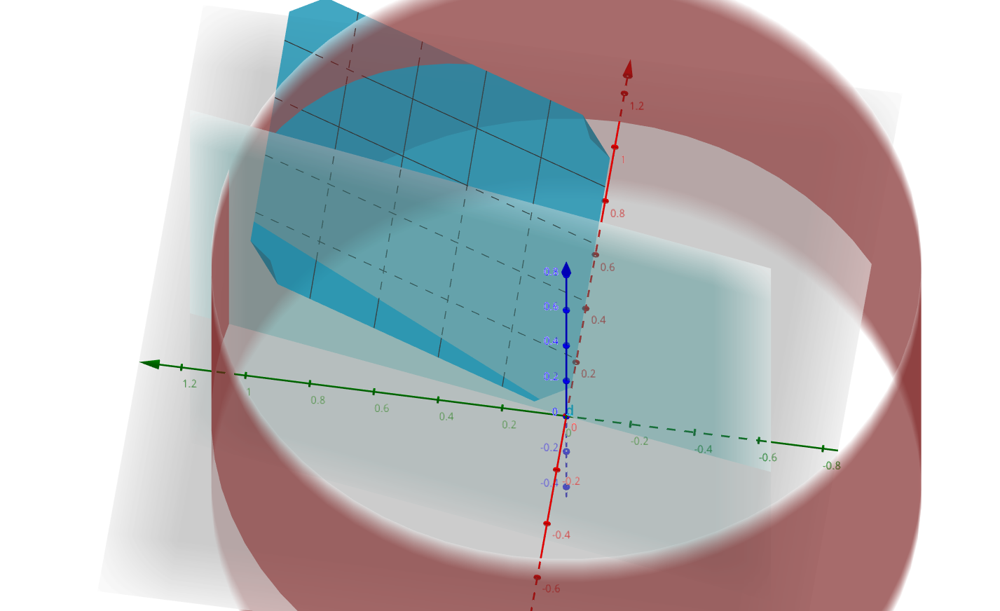

# I'm the title

## Derivation

we need

$$
\max_{\Theta} \sum_{i=1}^n \varepsilon_{i} F_i(\theta_{i}^{\ast}) \\
such~that~ \sum_{i=1}^n \theta_{i}^{\ast}F_i(\theta_{i}^{\ast}) = B \\
\underline{\theta} \leq \theta \leq  \bar{\theta} ~~ \forall i \in \{1,...,n\}
$$

instead we should try to solve this:

$$
\varepsilon_i f_{i}(\theta_i^{\ast}) - \lambda (F_{i}(\theta_i^{\ast}) +
\theta_{i}^{\ast}f_i(\theta_{i}^{\ast})) + \mu_i - \gamma_{i} = 0 \forall 1 \leq i \leq n \\
such~that\\
\mu_i(\underline{\theta} - \theta_i^{\ast}) = 0~\forall~1,...,n \\
\gamma_i(\theta_i^{\ast} - \bar{\theta}) = 0~\forall~1,...,n \\
\sum_{i=1}^n\theta_i^{\ast}F_{i}^{\ast}(\theta_{i}^{\ast}) - B = 0 \\
\lambda, \mu_i, ..., \mu_n, \gamma_1,...,\gamma_n \geq 0
$$

- $\theta_i^{\ast}$ 为所求
- $\underline{\theta}$ $\bar{\theta}$ 分别是 0,1
- $\lambda~\mu~\gamma$ 能消掉
- $f_i$ $F_i$ 分别是概率函数和分布函数，这里认为是平均分布，那么就有
  - $f_i(x) = 1$
  - $F_i(x) = x~where~0 \leq x \leq 1$
- $\varepsilon$ 是隐私因子，由用户输入
- $B$ 是 budget 由用户输入

那么还能继续化简

$$
\max_{\Theta} \sum_{i=1}^n \varepsilon_{i} \theta_{i}^{\ast} \\
such~that~ \sum_{i=1}^n {\theta_{i}^{\ast}}^2 = B \\
\underline{\theta} \leq \theta \leq  \bar{\theta} ~~ \forall i \in \{1,...,n\}
$$

## 复现计算方法

目前看来是个不等式约束凸优化问题，进一步分析，其实待优化值组成的空间是线性的。
约束条件有两个，一个是正方，一个是圆形。所以所求要看正方与园的相交情况。

分类讨论：

- 圆形在内部
  1. 导数就是向量的方向
  2. 二分法直到算出该方向在圆上的坐标，为所求
- 正方形在内部
  1. 那么所求为 1
- 相交（采用递归算法）
  1. 假设每个 $\theta^{\ast}_i$ 对应的 $\varepsilon_i$ 从大到小
  2. $\theta^{\ast}_1 = 1$
  3. $B:= B - \theta^{\ast}_1$
  4. 将剩余未求量组成的向量重新执行算法




算法：

```
# unoptimized

func([a1,...,an], B) -> [ans1, ..., ansn]
  if [1,...,1] is valid 
    return [1,...,1]
  else if sum_of_square([1, ...]) (which parallel with [a1, ... ,an]) > B
    let i = find index of max of [a1,...,an] 
    make 0 < bi < 1 and [b1,...,bn] has same direction with [a1,...,an]
    return binary search the intersection with that sum of square of [b1,...,bn] = B
  else
    find index of max of [a1,...,an]
    let B = B - 1
    let answer = call func(remain, B)
    return [1, *answer]
```


复杂度 $O(n^2)$, 优化后 $O(n\log_2n)$, 空间复杂度 $O(n)$

```python

# heavily optimized algorithm, epsilon_vec must be sorted first.
def _optimize(epsilon_vec: List[int], B: int) -> List[int]:
    
    # 倒序预处理平方和，方便后面调用
    sum_of_square_vec = [1] * len(epsilon_vec)
    for i in range(len(epsilon_vec)-2,-1,-1):
        print(type(i))
        sum_of_square_vec[i] = (((sum_of_square_vec[i+1]) * epsilon_vec[i+1]**2) \
                                  + epsilon_vec[i]**2) / epsilon_vec[i]**2

    theta_vec = []

    while len(epsilon_vec) > 0:
        # 如果满足最优解
        if len(epsilon_vec) < B:
            theta_vec.extend([1] * len(epsilon_vec))
            break

        # 如果能够确定焦点，二分法求解交点
        # if sum_of_square([i/epsilon_vec[0] for i in epsilon_vec]) > B:
        if sum_of_square_vec[0] > B:
            lower, upper = 0, 1 / epsilon_vec[0]
            while upper - lower > EPSILON:
                mid = (upper + lower) / 2
                l = [mid * i for i in epsilon_vec]
                if sum_of_square(l) >= B:
                    upper = mid
                else:
                    lower = mid
            theta_vec.extend(l)
            break

        # 否则，继续循环
        B = B - 1
        theta_vec.append(1)
        epsilon_vec = epsilon_vec[1:]
        sum_of_squre_vec = sum_of_squre_vec[1:]

    return theta_vec
```

## 凸优化的示例代码

```python

import cvxpy as cp

# Create two scalar optimization variables.
x = cp.Variable()
y = cp.Variable()

# Create two constraints.
constraints = [x + y == 1,
               x - y >= 1]

# Form objective.
obj = cp.Minimize((x - y)**2)

# Form and solve problem.
prob = cp.Problem(obj, constraints)
prob.solve()  # Returns the optimal value.
print("status:", prob.status)
print("optimal value", prob.value)
print("optimal var", x.value, y.value)

```
